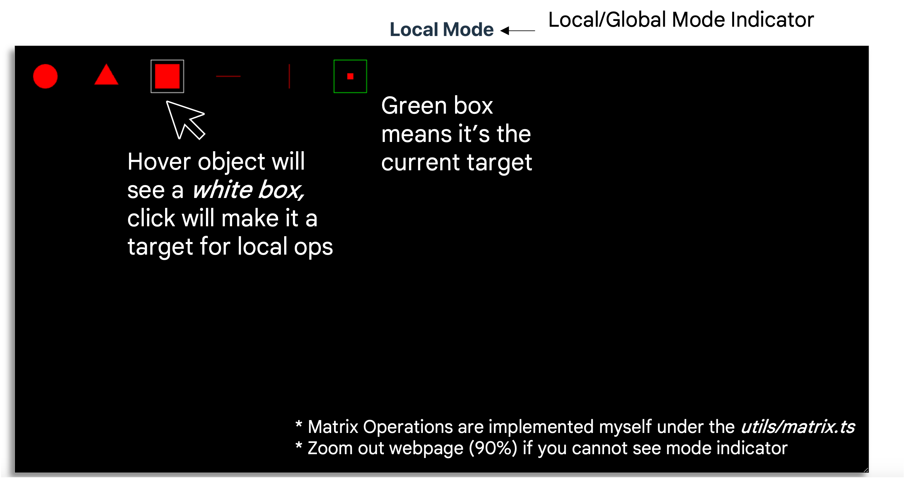

# CSE5542-RTRendering Lab 2

### Content
* Quick preview (deployed version): <a href="https://ryanq96.github.io/CSE5542-RTRendering/">URL</a>
* Codebase: https://github.com/RyanQ96/CSE5542-RTRendering
* Framework References: 
  * <a href="https://vuejs.org/">VueJS</a>: the framework for the interface. 
  * <a href="https://vuetifyjs.com/">VuetifyJS</a>: UI component library.
* How to run from Github:
  1. <code>git clone https://github.com/RyanQ96/CSE5542-RTRendering.git</code>
  2. <code>npm install</code> (make sure npm is installed on your local machine)
  3. <code>cd 5542-codebase</code>
  4. <code>git checkout lab2</code>
  5. <code>npm run dev</code> 
* Run from the ZIP (might have environment configuration issue) 
  1. <code>npm run dev</code>

* Repository Walkthrough 
  * <code>5542-codebase/src/</code> 
    * <code>components</code>: vue component for the interface, including appbar and the main view (canvas) of the interface 
    * <code>utils</code>: utility methods generally used in initialize webgl program 
      * <code>shaderUtils.ts</code>: utility functions to initialize shaders
      * <a><code style="color: green">matrix.ts</code>: matrix utility functions,including creating projection, translation, rotation matrix, their inverse and also matrix and vector multiplication operations.</a>
      * <a><code style="color: green">hierarchymodel.ts</code>: hierarchical model, including <code>HObj</code>class, its children class <code>Global</code> and each one of the shapes <code>Circle</code>, <code>Triangle</code> el al.</a>
    * <code>core</code>: core code for eventhander and webgl rendering
      * <code>setup-lab2.ts</code>: setup event listener 
      * <code>drawwebgl-new.ts</code>: main rendering code